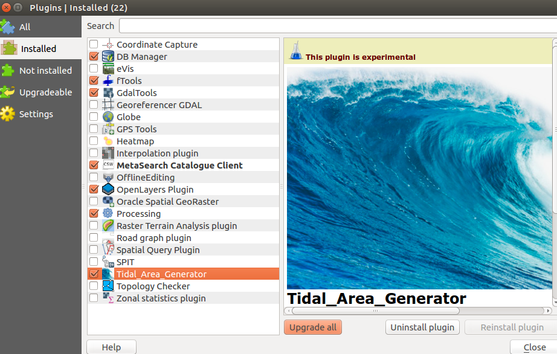
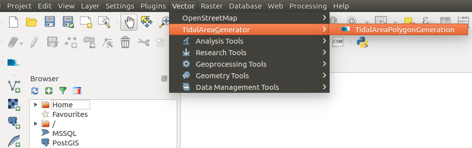
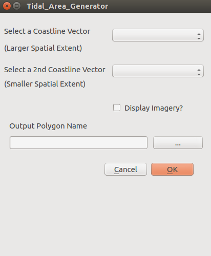

# Description

Gdal-poly is a tool for comparing two geographically intersected polyline geojson files.  The differences between the files is calculated and can be used as an accuracy measure if comparing a derivedis  vector to a reference vector or as a measurement of variabilty if comparing multiple derived vectors. This tool was designed to be used as a post-processing assessment tool for the Beachfront project (https://beachfront.geointservices.io)  This tool can be run as both a QGIS plugin as well as through the command line.

## QGIS Plugin instructions
Compatible with QGIS 2.18.16 and 3.0

Navigate to the python folder within your qgis installation directory.  For linux systems, this is likely /home/user/.qgis2 

~~~
cd /home/user/qgis2
~~~

Find the plugins path 

~~~
cd /home/user/qgis2/python/plugins. 
~~~

Copy the folder labeled "Polygon_Generator" from the gdal-poly repo into the plugins folder

~~~
cp -r ../home/user/Documents/gdal-polys/Polygon_Generator /home/user/.qgis2/python/plugins
~~~

Launch QGIS and select Plugins --> Manage and Install Plugins

Select the Installed tab, and verify that 'Tidal_Area_Generator' is checked.  Click the Close button.

To launch the tool, select Vector --> TidalAreaGenerator --> TidalAreaPolygonGeneration

Select the two geojson polyline files to compare

Select the output Polygon name.  Click the OK button.

## Docker

A Dockerfile is included for ease of development. The built docker image provides all the system dependencies needed to run the tool. The tool can also be tested locally, but all system dependencies must be installed first, and the use of a virtualenv is recommended.  A BASH script has been provided for deploying the docker image.

To run the docker image:

~~~
$ sh run_image.sh
~~~

Execute the python script from the Docker root promt

## Python Syntax:

usage: run_TA_extract.py --small_lines Smaller polyline file --large_lines Larger polyline file
                    [--out_name Outfile]
					
| Keys | Description
------|-------------------
| --small_lines | Polyline file with the smaller spatial extent containing coastlines	
| --large_lines | Polyline file with the larger spatial extent containing coastlines
| --out_name | Name of output shape file.  default='beachfront_poly.shp'

Sample Query:
~~~
 $python run_TA_extract.py --small_lines Landsat1.geojson --large_lines Landsat2.geojson --out_name Results.shp
~~~

# Algorithm

<Describe how the code works>

